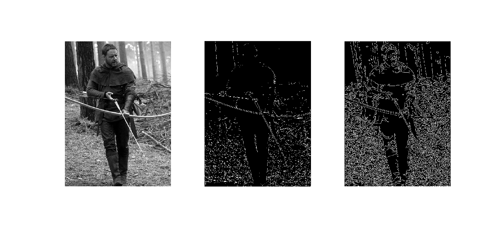

数字图像处理实验报告

自动化64               2160504103           魏慎行

摘要

   本次作业使用MATLAB对所给图像文件的相关处理：通过选择Sobel、Canny等算子进行边缘检测，并在此基础上进行Hough变换，借此进行直线检测。  
   最后通过实验结果图像的对比，比较不同算子的性能差异，并改变Hough变换的参数，比较不同参数对直线检测的影响。

***1. 首先对测试图像（文件名为：test1~test6）进行边缘检测，可采用书上介绍的Sobel等模板或者canny算子方法***    
  **Sobel**  
  Sobel算子是像素图像边缘检测中最重要的算子之一，在机器学习、数字媒体、计算机视觉等信息科技领域起着举足轻重的作用。在技术上，它是一个离散的一阶差分算子，用来计算图像亮度函数的一阶梯度之近似值。在图像的任何一点使用此算子，将会产生该点对应的梯度矢量或是其法矢量。
  该算子包含两组3x3的矩阵，分别为横向及纵向，将之与图像作平面卷积，即可分别得出横向及纵向的亮度差分近似值。如果以A代表原始图像，Gx及Gy分别代表经横向及纵向边缘检测的图像，其公式如下:  
    

  **Canny**  
  Canny边缘检测算子是John F. Canny于1986年开发出来的一个多级边缘检测算法。 

  Canny边缘检测算法可以分为以下5个步骤：

1)  使用高斯滤波器，以平滑图像，滤除噪声。

2)  计算图像中每个像素点的梯度强度和方向。

3)  应用非极大值（Non-Maximum Suppression）抑制，以消除边缘检测带来的杂散响应。

4)  应用双阈值（Double-Threshold）检测来确定真实的和潜在的边缘。

5)   通过抑制孤立的弱边缘最终完成边缘检测。

在MATLAB中使用edge函数可以进行边缘检测，通过第二个参数选择算子。  
**实验结果**  
所有图像从左到右为原图像、Sobel算子、Canny算子  
****test1**** 
  

****test2**** 

  

****test3**** 

  

****test4**** 

  

****test5**** 

  

****test6**** 

    

*****Sobel与Canny比较*****  
从实验的处理结果来看，Canny算子对边缘的检测能力要优于Sobel算子，它对图像细节的提取更加精确，而Sobel算子对一些较为复杂的图像处理则非常粗糙。
尽管Canny在处理上更加优秀，但是运算速度却大不如Sobel算子，处理较慢。 

*** 2、在边缘检测的基础上，用hough变换检测图中直线 ***  
Hough变换是一种使用表决原理的参数估计技术。其原理是利用图像空间和Hough参数空间的点－线对偶性，把图像空间中的检测问题转换到参数空间。  
先进行边缘检测，之后利用其进行Hough变换。  
1、Hough函数  
首先通过Hough函数选择直线检测的角度参数，生成H、theta、rho三个直线检测所需的参数  
2、HoughPeaks  
通过Houghpeaks函数检测峰值，通过峰值的个数来决定直线的条数。  
3、HoughLines  
最后将H、theta、rho、peak三个参数填入HoughLines函数，生成直线在图像矩阵的位置坐标。  
最后按照坐标的值在原图像中进行描出即可。  

****实验结果****  

***test1***
  
***test2***  
  
***test***  
  
***test4***  
  
***test5***  
   
***test6***  
   

******不同Hough变换参数的比较******  
1、 峰值的个数不同会改变直线的个数   
如取5和q7时，分别检测出了五条和七条直线     
如下图：   
    
    
2、 检测角度的不同会检测出不同角度的直线  
如角度间隔分别为0.2和2时，结果如下图：  
取0.2时：  
   
取2时：   
